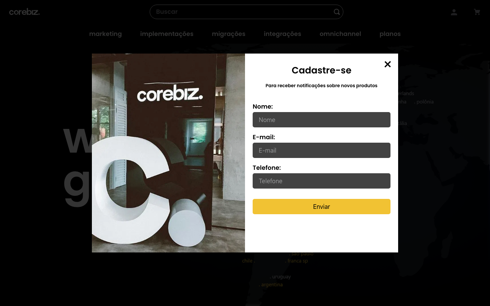
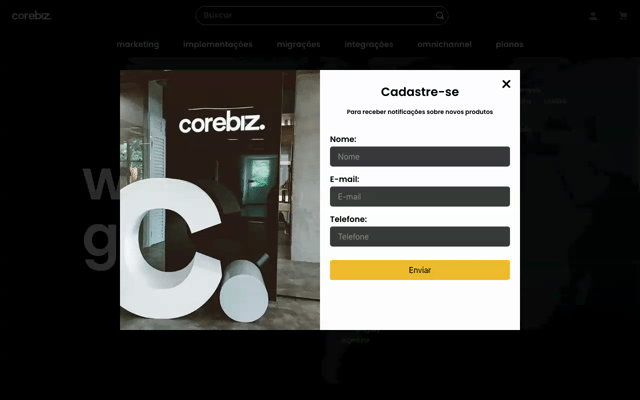

# Criar o README do repositório

Assign: Juslene Lobeu
Status: In progress



# Desafio final - Hiring Coders

Projeto final do programa Hiring Coders da Gama Academy, patrocinado pela VTEX, AWS, ACCT, Whirlpool, CoreBiz, We.di e Loja Integrada.

### Summary

  - [Desafio proposto](#desafio-proposto)
  - [O que fizemos](#o-que-fizemos)
    - [Tecnologias](#tecnologias)
    - [Como executar](#️como-executar)
  - [Implementações](#️implementações)
  - [Grupo 12](#grupo-12)

## Desafio proposto

Desenvolver um projeto e-Commerce com **VTEX IO** e implementação de API para captação de leads, salvando estes dados no `DynamoDB` da **AWS**, criar uma nova API para monitorar a compra do cliente no e-Commerce e ao finalizar o pedido fazer uma verificação no `DynamoDB` se este usuário já realizou um prévio cadastro de lead *(mantendo este cadastro com nome, email, telefone e data de cadastramento)*, caso haja cadastro, incluir a data da compra deste usuário e alterar o tipo de `prospect` para `client`.

### Bônus

Implementar no `/admin` do e-Commerce essa listagens de cadastro leads com prospectos e clientes.

### Back-end

- Criar uma **VTEX IO API** para servir os projetos e os pedidos vendidos
- Criar uma **AWS API** **Gateway** para gerenciar as vendas ativas na AWS, armazenando os cadastros de leads e clientes que fizeram compras no e-Commerce, para que a equipe de pós-venda possa entrar em contato com os clientes tentando fazer venda Ativa/Casada ou UPSELL.
- Criar uma **AWS API Gateway** para fazer a ligação entre as duas APIs. Ao concluir a compra, verificar se o usuário que finalizou é o mesmo usuário cadastrado na lead da API AWS e alterar o tipo deste usuário de `prospect` para `client`

### Front-end

Aplicar tema do patrocinador, com logo, cores e página de Quem Somos com informações sobre a empresa.

## O que fizemos

### 🚀 Tecnologias

- [VTEX IO](https://github.com/vtex-apps)
    - [Minimum-Boilerplate-Theme](https://github.com/vtex-apps/minimum-boilerplate-theme)
    - [Store-Components](https://github.com/vtex-apps/store-components)
    - [Assets](https://developers.vtex.com/vtex-developer-docs/docs/vtex-io-documentation-using-the-assets-builder)
    - [Routes](https://developers.vtex.com/vtex-developer-docs/docs/vtex-io-documentation-routes)
    - [Flex-Layout](https://github.com/vtex-apps/flex-layout)
    - [Condition-Layout](https://github.com/vtex-apps/condition-layout)
    - [Tab-Layout](https://github.com/vtex-apps/tab-layout)
    - [CustomQuery](https://github.com/vtex-apps/search-result)
    - [Slider-Layout](https://github.com/vtex-apps/slider-layout)
    - [Stack-Layout](https://github.com/vtex-apps/stack-layout)
    - [Menu](https://github.com/vtex-apps/menu)
    - [CSS-Handles](https://github.com/vtex-apps/css-handles)
    - [BlockClass](https://developers.vtex.com/vtex-developer-docs/docs/vtex-io-documentation-using-css-handles-for-store-customization#using-the-blockclass-property)
- [React](https://pt-br.reactjs.org/)
    - [TypeScript](https://www.typescriptlang.org/)
- [SASS](https://sass-lang.com/)
- [Axios](https://github.com/axios/axios)
- [React Input Mask](https://www.npmjs.com/package/react-input-mask)

### ⌨️ Como executar

Clone o projeto e acesse a pasta do mesmo

```bash
https://github.com/fabiodevelopment/gama-DesafioFinal.git
cd gama-DesafioFinal
```

Para instalar as dependências, siga os passos abaixo:

```bash
# Instalar as dependências

# CoreBiz Register
cd corebiz-register
yarn install
cd react
yarn install
touch workspaceName.ts
nano workspaceName.ts

# inserir: 
export default "{workspaceName}--"

# CoreBiz Admin
cd corebiz-admin
yarn install
cd react
yarn install
touch workspaceName.ts
nano workspaceName.ts

# inserir: 
export default "{workspaceName}--"
```

Para iniciá-lo, siga os passos abaixo:

```bash
# Login na VTEX
cd corebiz-store
vtex login hiringcoders202112 # realize seu login no browser

# Criar ou entrar em seu workspace
vtex use workspacename

# Verificar seu workspace
vtex whoami
```

```bash
# Link na VTEX

# CoreBiz Register
cd corebiz-register
vtex link

# CoreBiz Admin
cd corebiz-admin
vtex link

# CoreBiz Store
cd corebiz-store
vtex browse
vtex link
```

## 🖥️ Implementações

### Back-end

- Criação de funcionalidade para tratamento de cadastro de lead/newsletter e comportamento de popup.
- Criado função utilizando o `axios` para criação de lead no `DynamoDB`, utilizando Lambda e `API Gateway`
- Criado parâmetros para inserir nome, email, telefone e data de cadastro na AWS
- Criado função utilizando `localStorage` para armazenar informação de se o cliente clicou no botão fechar, o `popup` não deve ser exibido novamente dentro de 24hs e verificar também se o cliente já se cadastrou o `popup` não deverá ser exibido mais.
- Criação de funcionalidade para fazer o update de informação de prospect para client na AWS se o cliente efetuar uma compra
- Criado junto a `orderPlaced` utilizando `axios` a função de quando o cliente fizer a compra, atualizar o lead inserindo a data que o cliente `prospect` virou cliente.

### Admin

- Criação de funcionalidade no painel de admin para listagem de clientes/prospect
- Criado função que busca junto a AWS os leads/clientes cadastrados, trazendo também as datas de cadastro/compra e com base no email do cliente fizemos uma implementação para buscar a categoria favorita do cliente de acordo com a categoria de serviço/produto mais comprada.

### Front-end

- Criação de formulário em `react` e aplicação deste em **PopUp** na `home` para captação e `lead`. Verificação de o usuário já preencheu o formulário ou clicou em fechar para não exibir novamente.



- Menu com a listagens dos departamentos criados, aplicando:
    - `vtex-menu`
- Seção Hero com referência ao site institucional da CoreBiz
- Seção com aplicação de `tab-layout` contendo:
    - 3 `tab-layout-items` com as 3 classificações principais dos serviços oferecidos.
    - Prateleira de listagem de 8 produtos, utilizando `product-summary`
- Seção **About Us** com resumo da empresa e destaque ilustrativo dos valores, aplicando:
    - `Rich-text` para título, subtítulo e parágrafo
- Seção destacando seus principais clientes, aplicando:
    - `Rich-text` para o título
    - `Slider-layout` para as brands dos clientes da empresa
- Footer
    - Aplicando um grande impacto visual e referência a página institucional da empresa, utilizamos:
        - [Informar aqui...]
- Página de detalhes do produto aplicamos:
    - `conditional-layout` para exibir um banner com tema do departamento de referência do produto. *(em implementação, conferir antes de publicar)*
    - `breadcrumb` pensando na experiência de navegação do usuário
    - `product-image` para exibir a imagem do produto
    - `product-name` para o título deste produto
    - `product-price` para o preço
    - `product-description` para a descrição deste produto
    - `by-button` botão add-to-cart para incluir o produto no `minicart`
    - `share` para o compartilhamento do produto nas redes sociais

## Grupo 12

### Squads

- **Squad FullStack**
    - [Fábio Haddad Paes](https://github.com/fabiodevelopment) - PO / FullStack

- **Squad Back-end**
    - [Antonio Bastos Júnior](https://github.com/abastosjr) - Back-end
    - [Rubens](https://github.com/rubinhoSS) - Tech Lead - Back-end

- **Squad Front-end**
    - [Juslene Lobeu](https://github.com/fabiodevelopment) - Tech Lead - Front-end
    - [Alessandra Yamazaki](https://github.com/Yamazakiale) - UI/UX /Front-end
    - [Karen Pacheco](https://github.com/srtapacheco) - Front-end
    - [Raquel Nobre](https://github.com/raquel-nobre) - Front-end
    - [Vinícius Veloso](https://github.com/velosov) - Front-end
    - [Derikson](https://github.com/derikson-dev) - Font-end